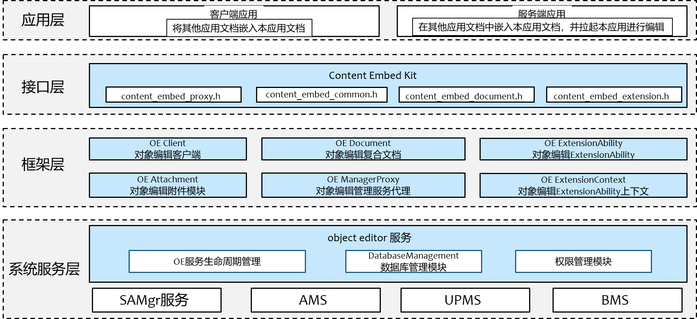
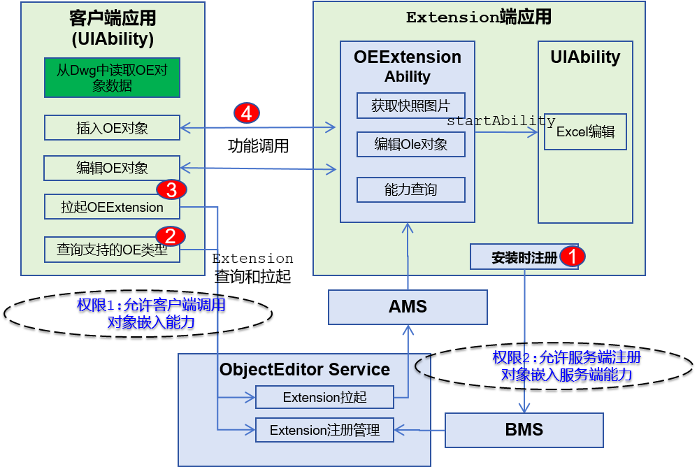

# officeservice_object_editor

## 简介
`object_editor` 是 OpenHarmony 系统中为开发者提供文档间互相嵌入能力的模块。
它提供的能力包括：
* 提供框架供三方应用实现OE服务端程序，向其他程序提供某些格式类型文档被嵌入和拉起编辑的能力。
* 提供客户端接口，供三方应用使用OE服务端的能力实现文档的嵌入和拉起编辑。
* 提供OE Package程序，用于为所有没有其他OE服务端支持的文档提供被嵌入和拉起编辑的能力。

object_editor 部件是一个可选系统能力，应用需要通过 SystemCapability.ContentEmbed.ObjectEditor 判断OpenHarmony设备是否支持文档间互相嵌入能力。

## 系统架构

<div align="center">
  
  <br>
  <b>图 1</b> 对象编辑框架整体架构图
</div>

### 模块功能说明

整体架构划分为应用层、接口层（提供API）、框架层、系统服务层。

* **应用层**
  * **客户端应用**: 终端用户应用。负责调用 object_editor 客户端接口，执行业务逻辑，如嵌入文档、展示文档快照及拉起服务端触发文档编辑操作。
  * **服务端应用**: 终端用户应用。负责向系统注册ObjectEditorExtensionAbility组件，向其他程序提供某些格式文档的被嵌入能力和拉起UIAbility编辑被嵌入文档。

* **接口层**
  * 对外提供客户端和服务端应用所需的实现文档嵌入及编辑接口。

* **框架层**
  * **OE Client**: 负责对外提供 `OH_ContentEmbed_CreateExtensionProxy/Destroy` 等接口，维护客户端上下文，并负责向系统申请或释放 object editor 服务资源。
  * **OE Document**: 负责对外提供object editor复合文档的API接口，供上层应用调用，处理客户端与服务端间被嵌入文档数据的同步和状态查询。
  * **OE ExtensionAbility**: 负责提供对象编辑extension组件供服务端应用注册，承载应用嵌入和拉起编辑业务能力。
  * **OE ExtensionContext**: 负责对象编辑extension组件的上下文管理。
  * **OE Package**: 负责为所有没有其他OE服务端支持的文档提供被嵌入和拉起编辑的能力。
  * **OE ManagerProxy**: 负责和对象编辑服务IPC通信。

* **系统服务层 (object editor Services)**
  * **object editor 服务生命周期管理**: 负责服务进程的启动与退出控制。它响应 SAMgr 的拉起请求完成初始化，并持续监控系统内的活跃会话和活跃extension；当无活跃客户端和extension且超时（如10分钟）后，触发资源释放与进程自动退出。
  * **数据库管理模块**：负责增加/删除/修改服务端应用注册的extension信息；当客户端拉起extension组件时提供extension信息。
  * **权限管理模块**：负责校验服务端注册OE Extension组件时是否具备权限；校验客户端查询OE Extension组件和拉起OE Extension组件时是否具备权限。

### 关键交互流程

对象编辑框架采用ExtensionAbility机制进行扩展，主要架构元素包括：
* 提供ObjectEditorExtensionAbility组件，用于应用程序实现某些格式类型文档嵌入和拉起编辑的能力。
* 提供Object Editor SA，实现对应ExtensionAbility的注册和管理能力。

为了更清晰地展示各模块如何协同工作，以下详解核心流程：

<div align="center">
  
  <br>
  <b>图 2</b> 对象编辑框架交互流程图
</div>

1. **Extension注册**：服务端应用安装时向系统注册ExtensionAbiilty信息及所支持的被嵌入文档格式。
2. **客户端查询能力**：查询系统当前可支持编辑的被嵌入文档的格式信息。
3. **客户端拉起Extension组件**：根据OE对象拉起ObjectEditorExtensionAbility组件。
4. **客户端与服务端通信**：Object Editor服务拉起Extension组件后，客户端通过ObjectEditorExtension定义的接口与服务端通信，实现获取被嵌入文档的快照、嵌入文档格式信息、拉起服务端界面编辑被嵌入文档等功能。

## 目录

仓目录结构如下：

```
/foundation/officeservice/object_editor    # 对象编辑部件业务代码
├── bundle.json                            # 部件描述与编译配置文件
├── object_editor.gni                      # 编译配置参数
├── figures                                # 架构图等资源文件
├── client                                 # 客户端核心逻辑
├── common                                 # 公共代码
├── database                               # 数据库管理模块
├── document                               # 复合文档实现
├── etc                                    # 进程启动配置（object_editor_service.cfg）
├── frameworks                             # 框架层实现
│   ├── kits
│   │    └── extension                     # extension实现
│   └── ndk                                # native接口实现
├── interfaces                             # 接口定义
│   ├── innerkits                          # 内部接口
│   └── kit                                # 对外接口
├── package                                # OE Package实现
├── sa_profile                             # 系统服务配置文件
├── system_ability                         # object editor服务层实现
├── test                                   # 测试代码
│    ├── fuzztest                          # Fuzzing测试用例
│    └── unittest                          # 单元测试用例
├── utils                                  # 工具代码目录

```

## 编译构建

根据不同的目标平台，使用以下命令进行编译：

**编译32位ARM系统object_editor部件**

```bash
./build.sh --product-name {product_name} --ccache --build-target object_editor
```

**编译64位ARM系统object_editor部件**

```bash
./build.sh --product-name {product_name} --ccache --target-cpu arm64 --build-target object_editor
```

> **说明：**
> `{product_name}` 为当前支持的平台名称，例如 `rk3568`。

## 使用说明

### 接口说明

object_editor部件向开发者提供了 **Native API**，主要涵盖客户端管理、设备管理及端口操作。主要接口及其功能如下：

**表 1** 接口说明

| 接口名称                      | 功能描述                                                             |
| ----------------------------- | -------------------------------------------------------------------- |
| **OH_ContentEmbed_CreateExtensionProxy**       | 创建OE Extension代理实例，初始化上下文环境，并可注册OE文档更新、编辑结束及错误回调。 |
| **OH_ContentEmbed_DestroyExtensionProxy**      | 销毁OE Extension代理实例，释放相关资源。                                   |
| **OH_ContentEmbed_Proxy_RegisterOnUpdateFunc**     | 向OE Extension代理实例注册OnUpdate回调，OE文档更新时会触发该回调。                                   |
| **OH_ContentEmbed_Proxy_RegisterOnErrorFunc**     | 向OE Extension代理实例注册OnError回调，OE文档异常时会触发该回调。                               |
| **OH_ContentEmbed_Proxy_RegisterOnEditingFinishedFunc**       | 向OE Extension代理实例注册OnEditingFinished回调，OE文档退出编辑时会触发该回调。                                             |
| **OH_ContentEmbed_Proxy_RegisterOnExtensionStoppedFunc**       | 向OE Extension代理实例注册OnExtensionStopped回调，OE Extension实例退出时会触发该回调。                                             |
| **OH_ContentEmbed_Proxy_StartWork**         | 客户端通过OE Extension代理实例与Object Editor服务跨进程通信，拉起OE Extension。                                 |
| **OH_ContentEmbed_Proxy_StopWork**      | 客户端通过OE Extension代理实例与Object Editor服务跨进程通信，关闭OE Extension，释放资源。                           |
| **OH_ContentEmbed_Proxy_GetSnapShot**        | 客户端通过OE Extension代理实例与服务端OE Extension跨进程通信，获取OE文档快照。                                     |
| **OH_ContentEmbed_Proxy_DoEdit**      | 客户端通过OE Extension代理实例与服务端OE Extension跨进程通信，通知服务端编辑OE文档。                           |
| **OH_ContentEmbed_Proxy_GetEditStatus**     | 客户端通过OE Extension代理实例与服务端OE Extension跨进程通信，获取OE文档编辑状态。                           |
| **OH_ContentEmbed_Proxy_GetCapability**               | 客户端通过OE Extension代理实例与服务端OE Extension跨进程通信，获取服务端是否能生成快照及是否支持编辑OE文档。                                         |
| **OH_ContentEmbed_Proxy_GetDocument**          | 获取OE文档数据                           |
| **OH_ContentEmbed_CreateDocumentByHmid**    | 通过hmid创建document对象。                                         |
| **OH_ContentEmbed_CreateDocumentByFile**          | 通过被嵌入文档路径创建document对象。                             |
| **OH_ContentEmbed_LoadDocumentFromFile**    | 通过已存在的被嵌入文档路径创建document对象。                                         |
| **OH_ContentEmbed_Document_Read**          | 从document对象中读取OE格式文件，存入buffer。                             |
| **OH_ContentEmbed_Document_GetHmid**          | 从document对象中获取hmid。                             |
| **OH_ContentEmbed_Document_IsLinking**    | 从document对象中获取linking信息。                                         |
| **OH_ContentEmbed_Document_GetNativeFilePath**          | 从document对象中获取OE格式文件路径。                             |
| **OH_ContentEmbed_Document_GetRootStorage**          | 从document对象中获取OE格式文件根目录。                             |
| **OH_ContentEmbed_Document_Flush**    | 将document对象中数据落盘至OE格式文件。                                         |
| **OH_ContentEmbed_Storage_CreateStorage**          | 根据父目录和名称创建子目录。                             |
| **OH_ContentEmbed_Storage_GetStorage**          | 根据父目录和名称获取子目录。                             |
| **OH_ContentEmbed_Storage_CreateStream**          | 根据父目录和名称创建OE格式文件流。                             |
| **OH_ContentEmbed_Storage_GetStream**    | 根据父目录和名称获取OE格式文件流。                                         |
| **OH_ContentEmbed_Storage_DeleteEntry**          | 根据名称删除指定父目录下的子目录或文件                             |
| **OH_ContentEmbed_DestroyStorage**          | 销毁目录对象，释放资源                             |
| **OH_ContentEmbed_Stream_Read**          | 从OE格式文件流中读取数据存入buffer                             |
| **OH_ContentEmbed_Stream_Write**    | 将数据写入OE格式文件流。                                         |
| **OH_ContentEmbed_Stream_Seek**          | 设置OE格式文件流的当前读取位置。                             |
| **OH_ContentEmbed_Stream_GetPosition**          | 获取OE格式文件流的当前读取位置。                             |
| **OH_ContentEmbed_Stream_GetSize**    | 获取OE格式文件流的数据大小。                                         |
| **OH_ContentEmbed_DestroyStream**          | 销毁OE格式文件流对象，释放资源。                             |
| **OH_ContentEmbed_DestroyDocument**          | 销毁OE文档对象，释放资源。                              |
| **OH_ContentEmbed_Extension_GetContentEmbedContext**          | 从OE Extension实例中获取上下文。                             |
| **OH_ContentEmbed_Extension_GetContext**          | 从OE Extension上下文中获取基类Extension上下文。                             |
| **OH_ContentEmbed_Extension_GetExtensionInstance**          | 从基类Extension实例中获取OE Extension实例。                             |
| **OH_ContentEmbed_Extension_RegisterOnCreateFunc**          | 向OE Extension实例注册OnCreate回调。                             |
| **OH_ContentEmbed_Extension_RegisterOnDestroyFunc**          | 向OE Extension实例注册OnDestroy回调。                             |
| **OH_ContentEmbed_Extension_RegisterOnWriteToDataStreamFunc**          | 向OE Extension实例注册OnWriteToDataStream回调。                             |
| **OH_ContentEmbed_Extension_RegisterOnGetSnapShotFunc**          | 向OE Extension实例注册OnGetSnapShot回调。                             |
| **OH_ContentEmbed_Extension_RegisterOnDoEditFunc**          | 向OE Extension实例注册OnDoEdit回调。                             |
| **OH_ContentEmbed_Extension_RegisterOnGetEditStatusFunc**          | 向OE Extension实例注册OnGetEditStatus回调。                             |
| **OH_ContentEmbed_Extension_RegisterOnGetCapabilityFunc**          | 向OE Extension实例注册OnGetCapability回调。                             |
| **OH_ContentEmbed_Extension_GetContentEmbedDocument**          | 从OE Extension实例获取document对象。                             |
| **OH_ContentEmbed_Extension_CallbackToOnUpdate**          | 通过OE Extension实例回调客户端OnUpdate函数。                             |
| **OH_ContentEmbed_Extension_CallbackToOnError**          | 通过OE Extension实例回调客户端OnError函数。                             |
| **OH_ContentEmbed_Extension_CallbackToOnEditingFinished**          | 通过OE Extension实例回调客户端OnEditingFinished函数。                             |
| **OH_ContentEmbed_Extension_CallbackToOnExtensionStopped**          | 通过OE Extension实例回调客户端OnExtensionStopped函数。                             |
| **OH_ContentEmbed_Extension_SetSnapshot**          | 向OE Extension实例设置快照。                             |
| **OH_ContentEmbed_Extension_ContextStartSelfUIAbility**          | 拉起UIAbility编辑OE文档。                             |
| **OH_ContentEmbed_Extension_ContextStartSelfUIAbilityWithStartOptions**          | 拉起UIAbility编辑OE文档。                             |
| **OH_ContentEmbed_Extension_ContextTerminateAbility**          | 销毁OE Extension。                             |

### 开发步骤

以下演示使用 Native API 开发 对象编辑客户端和服务端应用的完整流程，演示了在客户端中通过 file picker中选择文档嵌入客户端宿主文档，并编辑被嵌入文档；服务端注册Extension组件回调，并相应客户端请求，返回被嵌入文档快照和拉起UIAbility编辑被嵌入文档。
包含以下步骤：

1. **创建document对象**：获取到被嵌入文档路径后，创建document对象。
2. **创建OE Extension代理**：通过已创建的document对象创建OE Extensin代理对象。
3. **注册回调**：向OE Extension代理注册OE文档更新、Extension端异常、OE文档编辑结束及OE Extension组件退出回调。
4. **拉起OE Extension组件**：客户端通过OE Extension代理实例与Object Editor服务跨进程通信，拉起OE Extension组件。
5. **编辑被嵌入文档**：客户端通过OE Extension代理实例与服务端OE Extension跨进程通信，通知服务端编辑OE文档。
6. **释放资源**：销毁document对象及OE Extensin代理对象。

#### 客户端代码示例
```cpp

// 1. 定义OE文档更新回调
void ClientCallBack_OnUpdateFunc(ContentEmbed_ExtensionProxy *proxy) {
    // 通过OE Extension代理对象获取缩略图
    OH_PixelMapNative *snapshot;
    ContentEmbed_ErrorCode ret = OH_ContentEmbed_Proxy_GetSnapShot(proxy, &sapshot);
    // 通过snapshot更新客户端页面被嵌入文档缩略图
    /* ... */
}

// 2. 定义OE Extension端异常回调
void ClientCallBack_OnErrorFunc(ContentEmbed_ExtensionProxy *proxy, ContentEmbed_ErrorCode errorCode) {
    std::cout << "[Error] Critical Extension Error occurred! Code=" << errorCode
              << ". Client may need recreation." << std::endl;
    // 通过 OE Extension代理对象获取document对象
    ContentEmbed_Document *ceDocument;
    ContentEmbed_ErrorCode ret = OH_ContentEmbed_Proxy_GetDocument(proxy, &ceDocument);
    if (ret != CE_ERR_OK) {
        std::cout << "[Error] Get Document failed!"<< std::endl;
        return;
    }
    ret = WriteDocumentDataToAppFile(ceDocument, appFilePath_)
    if (ret != CE_ERR_OK) {
        std::cout << "[Error] Write Document data to app file failed!"<< std::endl;
        return;
    }
}

// 3. 从document对象中读取OE 格式文件流并写入客户端应用自定义路径文件下
ContentEmbed_ErrorCode WriteDocumentDataToAppFile(ContentEmbed_Document *document, const char *appFilePath)
{
    const size_t CHUNK_SIZE = 4096; // 分块大小
    uint8_t *buffer = new (std::nothrow) uint8_t[CHUNK_SIZE + 1];
    if (!buffer) {
        return CE_ERR_NULLPTR;
    }
    FILE *file = fopen(appFilePath, "wb");
    if (!file) {
        delete [] buffer;
        return CE_ERR_FILE_OPERATION_FAILED;
    }
    ContentEmbed_ErrorCode ret = CE_ERR_OK;
    size_t offset = 0;
    size_t actualRead = 0;
    do {
        ret = OH_ContentEmbed_Document_Read(buffer, CHUNK_SIZE, document, offset, &actualRead);

        if (ret != CE_ERR_OK || actualRead == 0) {
            break;
        }
        size_t written = fwrite(buffer, 1, actualRead, file);
        if (written != actualRead) {
            ret = CE_ERR_FILE_OPERATION_FAILED;
            break;
        }
        offset += actualRead;
    } while (true);

    fclose(file);
    delete [] buffer;
    return ret;
}

// 4. 定义OE文档编辑结束回调
void ClientCallBack_OnEditingFinishedFunc(ContentEmbed_ExtensionProxy *proxy, bool dataModified) {
    // 通过 OE Extension代理对象获取document对象
    ContentEmbed_Document *ceDocument;
    ContentEmbed_ErrorCode ret = OH_ContentEmbed_Proxy_GetDocument(proxy, &ceDocument);
    if (ret != CE_ERR_OK) {
        std::cout << "[OnEditingFinished] Get Document failed!"<< std::endl;
        return;
    }
    if (!dataModified) {
        return;
    }
    ret = WriteDocumentDataToAppFile(ceDocument, appFilePath_)
    if (ret != CE_ERR_OK) {
        std::cout << "[Error] Write Document data to app file failed!"<< std::endl;
        return;
    }
}

// 5. 定义OE Extension端退出回调
void ClientCallBack_OnExtensionStoppedFunc(ContentEmbed_ExtensionProxy *proxy) {
    // 通过 OE Extension代理对象获取document对象
    ContentEmbed_Document *ceDocument;
    ContentEmbed_ErrorCode ret = OH_ContentEmbed_Proxy_GetDocument(proxy, &ceDocument);
    if (ret == CE_ERR_OK) {
        ret = OH_ContentEmbed_DestroyDocument(ceDocument);
        if (ret != CE_ERR_OK) {
            std::cout << "[Error] Destroy document failed!"<< std::endl;
        }
    }
    ret = OH_ContentEmbed_DestroyExtensionProxy(proxy);
    if (ret != CE_ERR_OK) {
        std::cout << "[Error] Destroy proxy failed!"<< std::endl;
    }
}

// 在客户端中通过 file picker中选择文档嵌入客户端宿主文档，并编辑被嵌入文档
void ObjectEditorClientDemo()
{
    // 1.从file picker中获取被嵌入文档路径
    std::string filePath = GetFileFromPicker();
    // 2. 创建document对象
    ContentEmbed_Document *ceDocument;
    ContentEmbed_ErrorCode ret = OH_ContentEmbed_CreateDocumentByFile(filePath.c_str(), filePath.size(), false, &ceDocument);
    if (ret != CE_ERR_OK) {
        return;
    }
    // 3. 创建OE Extension代理对象
    ContentEmbed_ExtensionProxy *proxy;
    ret = OH_ContentEmbed_CreateExtensionProxy(ceDocument, &proxy);
    if (ret != CE_ERR_OK) {
        return;
    }
    // 4. 注册回调
    ret = OH_ContentEmbed_Proxy_RegisterOnUpdateFunc(proxy, ClientCallBack_OnUpdateFunc);
    if (ret != CE_ERR_OK) {
        return;
    }
    ret = OH_ContentEmbed_Proxy_RegisterOnErrorFunc(proxy, ClientCallBack_OnErrorFunc);
    if (ret != CE_ERR_OK) {
        return;
    }
    ret = OH_ContentEmbed_Proxy_RegisterOnEditingFinishedFunc(proxy, ClientCallBack_OnEditingFinishedFunc);
    if (ret != CE_ERR_OK) {
        return;
    }
    ret = OH_ContentEmbed_Proxy_RegisterOnExtensionStoppedFunc(proxy, ClientCallBack_OnExtensionStoppedFunc);
    if (ret != CE_ERR_OK) {
        return;
    }
    // 5. 拉起OE Extension组件
    ret = OH_ContentEmbed_Proxy_StartWork(proxy);
    if (ret != CE_ERR_OK) {
        return;
    }
    // 6. 编辑被嵌入文档
    ret = OH_ContentEmbed_Proxy_DoEdit(proxy);
    if (ret != CE_ERR_OK) {
        return;
    }

    // 7.资源释放
    OH_ContentEmbed_DestroyDocument(ceDocument);
    OH_ContentEmbed_DestroyExtensionProxy(proxy);
}

```

#### 服务端代码示例
```cpp

extern "C" void OH_AbilityRuntime_OnNativeExtensionCreate(AbilityRuntime_ExtensionInstance *instance, const char *abilityName)
{
    if (instance == nullptr) {
        return;
    }

    ContentEmbed_ExtensionInstanceHandle ceExtensionInstance;
    ContentEmbed_ErrorCode ret = OH_ContentEmbed_Extension_GetExtensionInstance(instance, &ceExtensionInstance);
    if (ret != CE_ERR_OK) {
        return;
    }
    ret = OH_ContentEmbed_Extension_RegisterOnCreateFunc(ceExtensionInstance, OnCreate);
    if (ret != CE_ERR_OK) {
        return;
    }

    ret = OH_ContentEmbed_Extension_RegisterOnDestroyFunc(ceExtensionInstance, OnDestroy);
    if (ret != CE_ERR_OK) {
        return;
    }

    ret = OH_ContentEmbed_Extension_RegisterOnWriteToDataStreamFunc(ceExtensionInstance, OnWriteToDataStream);
    if (ret != CE_ERR_OK) {
        return;
    }

    ret = OH_ContentEmbed_Extension_RegisterOnGetCapabilityFunc(ceExtensionInstance, OnGetCapability);
    if (ret != CE_ERR_OK) {
        return;
    }

    ret = OH_ContentEmbed_Extension_RegisterOnDoEditFunc(ceExtensionInstance, OnDoEdit);
    if (ret != CE_ERR_OK) {
        return;
    }

    ret = OH_ContentEmbed_Extension_RegisterOnGetSnapShotFunc(ceExtensionInstance, OnGetSnapShot);
    if (ret != CE_ERR_OK) {
        return;
    }

    ret = OH_ContentEmbed_Extension_RegisterOnGetEditStatusFunc(ceExtensionInstance, OnGetSnapShot);
    if (ret != CE_ERR_OK) {
        return;
    }
}

void OnCreate(ContentEmbed_ExtensionInstanceHandle instance, AbilityBase_Want *want)
{
    std::cout << "[OnCreate] Extension Create."<< std::endl;
}

void OnDestroy(ContentEmbed_ExtensionInstanceHandle instance)
{
    std::cout << "[OnDestroy] Extension Destroy."<< std::endl;
}

void OnWriteToDataStream(ContentEmbed_ExtensionInstanceHandle instance)
{
    ContentEmbed_ErrorCode ret = CE_ERR_OK;
    ContentEmbed_Document *ceDocument = nullptr;
    ret = OH_ContentEmbed_Extension_GetContentEmbedDocument(instance, &ceDocument);

    ContentEmbed_Storage *rootStorage = nullptr;
    ret = OH_ContentEmbed_Document_GetRootStorage(ceDocument, &rootStorage);

    ContentEmbed_Stream *destStream = nullptr;
    ret = OH_ContentEmbed_Storage_GetStream(rootStorage, "test", &destStream);
    if (ret != CE_ERR_OK) {
        OH_ContentEmbed_Storage_CreateStream(rootStorage, "test", &destStream);
    }

    // 获取客户端沙箱内被嵌入文档路径
    char nativeFilePath[MAX_PATH_LENGTH];
    OH_ContentEmbed_Document_GetNativeFilePath(ceDocument, nativeFilePath);
    std::string srcStreamPath(nativeFilePath);
    std::ifstream srcStream(srcStreamPath, std::ios::binary);
    if (!srcStream) {
        return;
    }
    srcStream.seekg(0, std::ios::end);
    size_t srcStreamSize = srcStream.tellg();
    srcStream.seekg(0, std::ios::end);
    std::vector<unsigned char> buffer(srcStreamSize);
    srcStream.read(reinterpret_cast<char*>(buffer.data()), srcStreamSize);
    size_t length = 0;
    ret = OH_ContentEmbed_Stream_Write(destStream, buffer.data(), srcStreamSize, &length);

    OH_ContentEmbed_Document_Flush(ceDocument);
}

void OnGetCapability(ContentEmbed_ExtensionInstanceHandle instance, uint32_t *bitMask)
{
    // 若服务端应用支持获取文档快照和支持编辑
    *bitMask = CE_CAPABILITY_SUPPORT_SNAPSHOT | CE_CAPABILITY_SUPPORT_DO_EDIT;
}

void OnDoEdit(ContentEmbed_ExtensionInstanceHandle instance)
{
    ContentEmbed_ErrorCode ret = CE_ERR_OK;
    ContentEmbed_Document *ceDocument = nullptr;
    ret = OH_ContentEmbed_Extension_GetContentEmbedDocument(instance, &ceDocument);

    ContentEmbed_Storage *rootStorage = nullptr;
    ret = OH_ContentEmbed_Document_GetRootStorage(ceDocument, &rootStorage);

    ContentEmbed_Stream *openStream = nullptr;
    ret = OH_ContentEmbed_Storage_GetStream(rootStorage, "test", &openStream);

    // 从流中获取文件数据
    char *openFileUri;
    if (ret == CE_ERR_OK) {
        size_t bufferSize;
        ret = OH_ContentEmbed_Stream_GetSize(openStream, &bufferSize);

        ret = OH_ContentEmbed_Stream_Seek(openStream, 0);
        unsigned char *buffer;
        size_t length = 0;
        ret = OH_ContentEmbed_Stream_Read(openStream, &buffer, bufferSize, &length);
        std::string openFilePath("/data/storage/el2/base/cache/test.txt");
        std::ofstream outputFile(openFilePath, std::ios::out | std::ios::binary);
        if (outputFile.is_open()) {
            outputFile.write(reinterpret_cast<const char*>(buffer), bufferSize);
            outputFile.close();
        }

        OH_FileUri_GetUriFromPath(openFilePath.c_str(), openFilePath.size(), &openFileUri);
    }

    // 拉起UIAbility编辑文档
    ContentEmbed_ExtensionContextHandle context;
    ret = OH_ContentEmbed_Extension_GetContentEmbedContext(instance, &context);

    AbilityBase_Element element = {
        .bundleName = "com.huawei.oeserverdemo",
        .moduleName = "entry",
        .abilityName = "EntryAbility",
    };
    AbilityBase_Want *want = OH_AbilityBase_CreateWant(element);
    OH_AbilityBase_SetWantUri(want, openFileUri);
    int32_t result = OH_ContentEmbed_Extension_ContextStartUIAbility(context, want);
}

void OnGetSnapShot(ContentEmbed_ExtensionInstanceHandle instance)
{
    // 通过快照创建ImageSource实例
    OH_ImageSourceNative *source;

    // 创建pixelMap对象
    OH_PixelmapNative *resPixMap = nullptr;
    Image_ErrorCode errCode = OH_ImageSourceNative_CreatePixelmap(source, nullptr, &resPixMap);
    if (errCode != IMAGE_SUCCESS) {
        return;
    }
    ContentEmbed_ErrorCode ret = OH_ContentEmbed_Extension_SetSnapshot(instance, resPixMap);
}

void OnGetEditStatus(ContentEmbed_ExtensionInstanceHandle instance, bool *isEditing, bool *isModified)
{
    // 若文档未处于编辑态
    *isEditing = false;
    *isModified = false;
}
```
## 相关仓
[ability_runtime](https://gitcode.com/openharmony/ability_ability_runtime)<br>
[bundlemanager_bundle_framework](https://gitcode.com/openharmony/bundlemanager_bundle_framework)<br>
[distributeddatamgr_relational_store](https://gitcode.com/openharmony/distributeddatamgr_relational_store)<br>
**[object_editor](https://gitcode.com/openharmony-sig/officeservice_object_editor)**