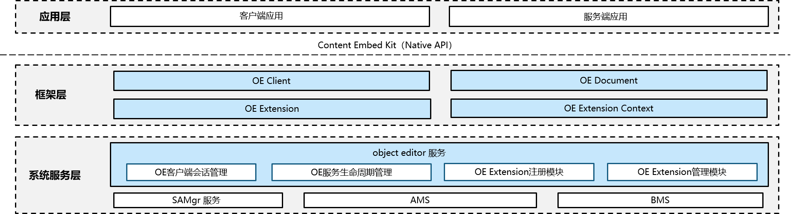
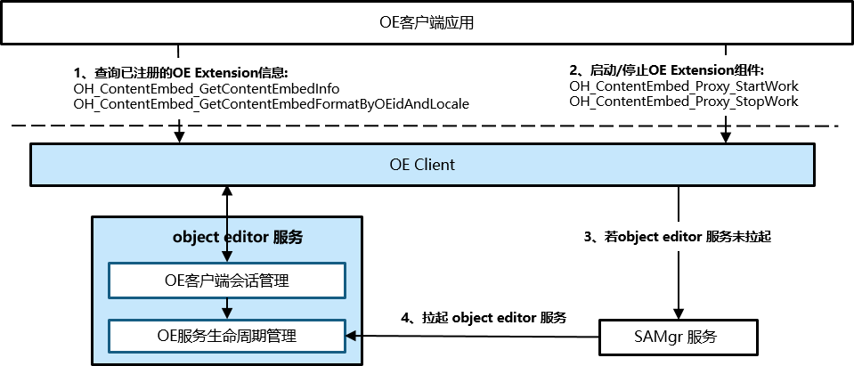
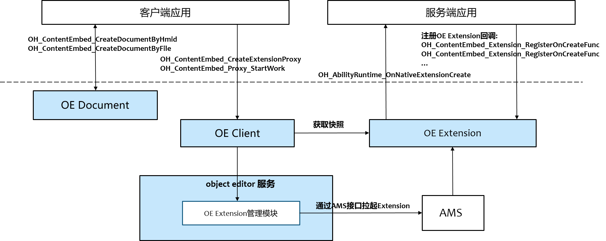
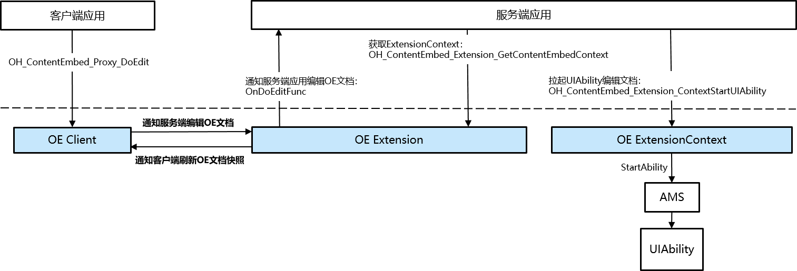

# officeservice_object_editor

## 简介
`object_editor` 是 OpenHarmony 系统为开发者提供应用间文档互相嵌入能力的模块，以下简称为`OE`。
它提供的能力包括：
* 提供框架，供三方应用实现OE服务端程序，以向客户端应用提供某些格式类型文档被嵌入和拉起编辑的能力。
* 提供客户端接口，供三方应用使用OE服务端的能力，以在本应用的文档中嵌入其它文档并按需拉起编辑。

`object_editor` 是一个可选系统能力，应用需要通过 SystemCapability.ContentEmbed.ObjectEditor [**判断OpenHarmony设备是否支持本能力**](https://gitcode.com/openharmony/docs/blob/master/zh-cn/application-dev/reference/common/syscap__ndk_8h.md)。


## 术语与缩略语
1. **OE**：object editor缩写，OpenHarmony提供的对象编辑功能框架和技术。
2. **OE对象**：为开发者提供用于实现对象嵌入和编辑的程序对象，一般指的是某个ObjectEditorExtensionAbility在客户端的代理。
3. **OE文档**：以OE技术实现的被嵌入文档，它在客户端界面中可能呈现为缩略图或者Snapshot，也可能以标准格式序列化为一段二进制数据保存在内存或者某个文件中。
4. **OE服务端**：实现ObjectEditorExtensionAbility的程序，有时也称为Extension端。
5. **HMID**：全称Harmony ID，OE文档的系统可读的ID，携带在OE文档中，系统用HMID来定位支持该OE文档的服务端程序。

## 系统架构

<div align="center">
  <b>图 1</b> 对象编辑框架整体架构图
  
  <br>
</div>

### 模块功能说明

整体架构划分为应用层、框架层、系统服务层。

* **应用层**
  * **客户端应用**：包含被嵌入文档的宿主文档对应的终端用户应用。负责调用OE客户端接口，执行业务逻辑，如嵌入文档、展示文档快照及拉起服务端触发文档编辑操作。
  * **服务端应用**：为客户端应用提供某些格式文档被嵌入能力的终端用户应用。负责向系统注册ObjectEditorExtensionAbility组件，在运行时被系统拉起响应客户端文档嵌入和编辑请求。
如在CAD文档中嵌入Excel表格，支持编辑CAD文档的应用是客户端应用，支持编辑Excel表格的应用是服务端应用。

* **框架层**
  * **OE Client**：负责对外提供 `OH_ContentEmbed_CreateExtensionProxy` 和 `OH_ContentEmbed_DestroyExtensionProxy` 等客户端应用需要使用的接口及框架实现。
  * **OE Document**：负责对外提供OE文档读写能力的API接口及框架实现，供客户端和服务端应用生成和解析符合OE文档标准的数据。
  * **OE Extension**：负责对外提供OE Extension组件的开发接口及框架实现，供服务端应用使用，实现应用嵌入和拉起编辑业务能力。
  * **OE Extension Context**：负责管理OE Extension组件的运行时环境和相关资源。

* **系统服务层 (Object Editor Service)**
  * **OE 客户端会话管理**：负责响应客户端的 IPC 请求，管理跨进程会话资源。
  * **OE 服务生命周期管理**：负责object editor服务进程的启动与退出控制。它响应 SAMgr 的拉起请求完成初始化，并持续监控系统内的活跃会话和活跃OE Extension；当无活跃会话和OE Extension且超时（如10分钟）后，触发资源释放与进程自动退出。
  * **OE Extension注册模块**：负责增加/删除/修改服务端应用注册的OE Extension信息。
  * **OE Extension管理模块**：负责OE Extension组件拉起、销毁的全生命周期管理及并发数量控制。
  * **SAMgr 服务（System Ability Manager）**：系统能力管理服务，负责object editor服务进程的按需拉起。
  * **AMS (Ability Manager Service)**：Ability管理服务，为object editor服务提供innerApi `ConnectExtensionAbility/DisconnectExtensionAbility`启动和停止OE ExtensionAbility。
  * **BMS (Bundle Manager Service)**：包管理服务，为object editor服务提供已安装应用的OE Extension信息。

### 关键交互流程

为了更清晰地展示各模块如何协同工作，以下详解四大核心流程：

#### 服务按需启动与生命周期管理

object editor服务采用 **“按需启动、自动退出”** 的策略，以降低系统资源消耗。

<div align="center">
  <b>图 2</b> 服务按需启动与生命周期管理流程图
  
  <br>
</div>

1. **拉起服务**：
   * 当 **客户端应用** 调用 `OH_ContentEmbed_GetContentEmbedInfo/OH_ContentEmbed_GetContentEmbedFormatByHmidAndLocale/OH_ContentEmbed_Proxy_StartWork/OH_ContentEmbed_Proxy_StopWork` 时，**OE Client** 模块会向 **SAMgr 服务** 查询 object editor 服务代理。
   * 若服务未启动，**SAMgr 服务** 会自动拉起 object editor 服务进程，并完成服务的初始化。
2. **建立会话**：
   * 服务启动后，客户端通过 IPC 与服务端的 **OE 客户端会话管理** 模块建立连接，分配对应的服务资源。
3. **资源回收**：
   * **主动销毁**：当 **客户端应用** 调用 `OH_ContentEmbed_Proxy_StopWork` 时，object editor服务会停止对应的OE Extension并释放对应资源。
   * **异常监测**：建立连接时，客户端会将回调对象（Stub）注册至object editor服务。该服务的 **OE 客户端会话管理** 模块通过 IPC 机制订阅该对象的[**断开回调（Death Recipient）**](https://gitcode.com/openharmony/docs/blob/master/zh-cn/application-dev/ipc/subscribe-remote-state.md)，服务端感知后，立即清理该客户端占用的会话并会停止对应的OE Extension。
   * **退出判定**：**OE 服务生命周期管理** 模块持续监控会话状态和OE Extension状态。当活跃客户端和活跃OE Extension状态数量降为0，且在10分钟内无新的连接建立时，该模块执行服务资源释放逻辑并自动退出进程。

#### OE Extension注册流程

<div align="center">
  <b>图 3</b> OE Extension注册流程图
  
  <br>
</div>

1. **服务端应用配置OE ExtensionAbility**：
   * 从API version24开始，支持开发者在module.json5的extensionAbilities标签中配置OE Extension，示例如下：
        ```
        "extensionAbilities": [
            {
                "name": "OEExtAbility",
                "srcEntry": "./libentry.so",
                "type": "contentEmbed",
                "exported": true,
                "metadata": [
                    {
                        "name": "content_embed_config",
                        "resource": "$profile:content_embed_config"
                    }
                ]
            }
        ]
        ```
    * 开发者可以新增二级配置json文件，以启用OE配置。其中，json文件需要开发者自行创建并放置到工程目录下。推荐的文件名及路径为`resources/base/profile/content_embed_config.json` 。json文件配置示例如下：
        ```
        "content_embed_config": [
            {
                "hmid": "E0A8B74A-445B-4D7A-8B05-07B5509B50D8",
                "file_exts": ".txt",
                "icon": "$media:app_logo",
                "name": "$string:name",
                "description": "$string:description"
            }
        ]
        ```
2. **OE Extension信息注册**：
   * 应用安装、卸载及更新时，**BMS** 会存储/删除/更新应用包信息，应用包信息中包含OE Extension信息。
   * 若object editor服务进程未启动，则object editor服务启动时会向BMS查询所有已安装应用的OE Extension信息。
   * 若object editor服务进程已启动，则object editor服务监听BMS事件通知，以增加/修改/删除应用的OE Extension信息。

#### OE 文档嵌入流程

<div align="center">
  <b>图 4</b> OE 文档嵌入流程图
  
  <br>
</div>

1. **创建OE文档**：
   * 当 **客户端应用** 调用 `OH_ContentEmbed_CreateDocumentByHmid/OH_ContentEmbed_CreateDocumentByFile` 时，**OE Document** 模块会创建OE文档，并将该文档对象返回 **客户端应用**。
2. **拉起OE Extension**：
   * **客户端应用** 首先调用 `OH_ContentEmbed_CreateExtensionProxy` 创建OE Extension代理，然后通过该代理调用 `OH_ContentEmbed_Proxy_StartWork` 通知**object editor 服务**拉起OE Extension组件。
3. **服务端应用被拉起及注册OE Extension回调**：
   * **object editor 服务** 通过**AMS**接口拉起服务端应用的Extension进程，此时会执行OE Extension的入口函数`OH_AbilityRuntime_OnNativeExtensionCreate`，在该函数中服务端应用需通过注册OE Extension的回调函数以响应客户端请求。OE Extension的回调函数包括`OH_ContentEmbed_Extension_RegisterOnCreateFunc`、`OH_ContentEmbed_Extension_RegisterOnDestroyFunc`、`OH_ContentEmbed_Extension_RegisterOnGetSnapshotFunc`等。
4. **客户端获取OE 文档快照**：
   * **客户端应用** 调用 `OH_ContentEmbed_Proxy_GetSnapshot` 与OE Extension通信，获取OE文档的快照。

#### OE 文档编辑流程

<div align="center">
  <b>图 5</b> OE 文档编辑流程图
  
  <br>
</div>

1. **客户端通知服务端编辑OE文档**：
   * 若OE Extension已被拉起，则 **客户端应用** 调用 `OH_ContentEmbed_Proxy_DoEdit` 与 OE Extension通信，通知服务端编辑OE文档。
   * 若OE Extension未被拉起，则 **客户端应用** 需先调用 `OH_ContentEmbed_Proxy_StartWork`拉起OE Extension。
2. **服务端拉起UIAbility编辑OE文档**：
   * 当 **服务端应用** OnDoEditFunc回调被触发时，首先调用 `OH_ContentEmbed_Extension_GetContentEmbedContext` 获取OE Extension Context，然后通过该Context调用 `OH_ContentEmbed_Extension_ContextStartSelfUIAbility` 通知**AMS**拉起UIAbility组件，此时用户可在UIAbility组件中编辑OE 文档。
3. **客户端刷新OE 文档快照**：
   * 当OE 文档更新时，**服务端应用** 调用 `OH_ContentEmbed_Extension_CallbackToOnUpdate` 通知 **客户端应用**刷新快照。
   * 当 **客户端应用** 收到回调通知时，应调用`OH_ContentEmbed_Proxy_GetSnapshot`主动获取OE文档快照并刷新页面。

## 目录

仓目录结构如下：

```
/foundation/officeservice/object_editor    # 对象编辑部件业务代码
├── bundle.json                            # 部件描述与编译配置文件
├── object_editor.gni                      # 编译配置参数
├── figures                                # 架构图等资源文件
├── client                                 # 客户端核心逻辑
├── common                                 # 公共代码
├── database                               # 数据库管理模块
├── document                               # 复合文档实现
├── etc                                    # 进程启动配置（object_editor_service.cfg）
├── frameworks                             # 框架层实现
│   ├── kits
│   │    └── extension                     # extension实现
│   └── ndk                                # native接口实现
├── interfaces                             # 接口定义
│   ├── innerkits                          # 内部接口
│   └── kit                                # 对外接口
├── attachment                             # OE Attachment实现
├── sa_profile                             # 系统服务配置文件
├── system_ability                         # object editor服务层实现
├── test                                   # 测试代码
│    ├── fuzztest                          # Fuzzing测试用例
│    └── unittest                          # 单元测试用例
├── utils                                  # 工具代码目录

```

## 编译构建

根据不同的目标平台，使用以下命令进行编译：

**编译32位ARM系统object_editor部件**

```bash
./build.sh --product-name {product_name} --ccache --build-target object_editor
```

**编译64位ARM系统object_editor部件**

```bash
./build.sh --product-name {product_name} --ccache --target-cpu arm64 --build-target object_editor
```

> **说明：**
> `{product_name}` 为当前支持的平台名称，例如 `rk3568`。

## 使用说明

### 接口说明

object_editor部件向开发者提供了 **Native API**，主要涵盖客户端管理、服务端Extension注册、OE文档操作。主要接口及其功能如下：

**表 1** 接口说明

| 接口名称                      | 功能描述                                                             |
| ----------------------------- | -------------------------------------------------------------------- |
| **OH_ContentEmbed_CreateExtensionProxy**       | 创建OE Extension代理，初始化上下文环境，并可注册OE文档更新、编辑结束及错误回调。 |
| **OH_ContentEmbed_DestroyExtensionProxy**      | 销毁OE Extension代理，释放相关资源。                                   |
| **OH_ContentEmbed_Proxy_RegisterOnUpdateFunc**     | 向OE Extension代理注册OnUpdate回调，OE文档更新时由服务端触发该回调。                                   |
| **OH_ContentEmbed_Proxy_RegisterOnErrorFunc**     | 向OE Extension代理注册OnError回调，OE文档异常时由服务端触发该回调。                               |
| **OH_ContentEmbed_Proxy_RegisterOnEditingFinishedFunc**       | 向OE Extension代理注册OnEditingFinished回调，OE文档退出编辑时由服务端触发该回调。                                             |
| **OH_ContentEmbed_Proxy_RegisterOnExtensionStoppedFunc**       | 向OE Extension代理注册OnExtensionStopped回调，OE Extension实例退出时会触发该回调。                                             |
| **OH_ContentEmbed_Proxy_StartWork**         | 客户端通过OE Extension代理与Object Editor服务跨进程通信，拉起OE Extension组件，并初始化上下文。                                 |
| **OH_ContentEmbed_Proxy_StopWork**      | 客户端通过OE Extension代理与Object Editor服务跨进程通信，关闭OE Extension组件，释放资源。                           |
| **OH_ContentEmbed_Proxy_GetSnapshot**        | 客户端通过OE Extension代理与OE Extension端跨进程通信，获取OE文档快照。                                     |
| **OH_ContentEmbed_Proxy_DoEdit**      | 客户端通过OE Extension代理与OE Extension组件跨进程通信，通知服务端拉起UIAbility编辑OE文档。                           |
| **OH_ContentEmbed_Proxy_GetDocument**          | 通过OE Extension代理获取OE文档。                           |
| **OH_ContentEmbed_CreateDocumentByHmid**    | 通过HMID创建OE文档。                                         |
| **OH_ContentEmbed_CreateDocumentByFile**          | 通过被嵌入文档路径创建OE文档。                             |
| **OH_ContentEmbed_LoadDocumentFromFile**    | 通过已存在的被嵌入文档路径加载OE文档。                                         |
| **OH_ContentEmbed_Document_Read**          | 从OE文档中读取OE格式文件数据，存入buffer。                             |
| **OH_ContentEmbed_Document_GetNativeFilePath**          | 从OE文档中获取客户端沙箱目录下存储的被嵌入源文件路径。                             |
| **OH_ContentEmbed_Document_GetRootStorage**          | 从OE文档中获取OE格式文件根目录。                             |
| **OH_ContentEmbed_Document_Flush**    | 将OE文档中数据落盘至OE格式文件。                                         |
| **OH_ContentEmbed_Storage_CreateStorage**          | 根据父目录和名称创建子目录。                             |
| **OH_ContentEmbed_Storage_GetStorage**          | 根据父目录和名称获取子目录。                             |
| **OH_ContentEmbed_Storage_CreateStream**          | 根据父目录和名称创建OE格式文件流。                             |
| **OH_ContentEmbed_Storage_GetStream**    | 根据父目录和名称获取OE格式文件流。                                         |
| **OH_ContentEmbed_Stream_Read**          | 从OE格式文件流中读取数据存入buffer。                             |
| **OH_ContentEmbed_Stream_Write**    | 将数据写入OE格式文件流。                                         |
| **OH_ContentEmbed_Stream_Seek**          | 设置OE格式文件流的当前读取位置。                             |
| **OH_ContentEmbed_Stream_GetSize**    | 获取OE格式文件流的数据大小。                                         |
| **OH_ContentEmbed_DestroyStream**          | 销毁OE格式文件流对象，释放资源。                             |
| **OH_ContentEmbed_DestroyDocument**          | 销毁OE文档对象，释放资源。                              |
| **OH_ContentEmbed_Extension_GetContentEmbedContext**          | 从OE Extension实例中获取上下文。                             |
| **OH_ContentEmbed_Extension_GetExtensionInstance**          | 从基类Extension实例中获取OE Extension实例。                             |
| **OH_ContentEmbed_Extension_RegisterOnCreateFunc**          | 向OE Extension实例注册OnCreate回调。                             |
| **OH_ContentEmbed_Extension_RegisterOnDestroyFunc**          | 向OE Extension实例注册OnDestroy回调。                             |
| **OH_ContentEmbed_Extension_RegisterOnWriteToDataStreamFunc**          | 向OE Extension实例注册OnWriteToDataStream回调。                             |
| **OH_ContentEmbed_Extension_RegisterOnGetSnapshotFunc**          | 向OE Extension实例注册OnGetSnapshot回调。                             |
| **OH_ContentEmbed_Extension_RegisterOnDoEditFunc**          | 向OE Extension实例注册OnDoEdit回调。                             |
| **OH_ContentEmbed_Extension_RegisterOnGetEditStatusFunc**          | 向OE Extension实例注册OnGetEditStatus回调。                             |
| **OH_ContentEmbed_Extension_RegisterOnGetCapabilityFunc**          | 向OE Extension实例注册OnGetCapability回调。                             |
| **OH_ContentEmbed_Extension_GetContentEmbedDocument**          | 从OE Extension实例获取document对象。                             |
| **OH_ContentEmbed_Extension_CallbackToOnUpdate**          | 通过OE Extension实例回调客户端OnUpdate函数。                             |
| **OH_ContentEmbed_Extension_CallbackToOnEditingFinished**          | 通过OE Extension实例回调客户端OnEditingFinished函数。                             |
| **OH_ContentEmbed_Extension_CallbackToOnExtensionStopped**          | 通过OE Extension实例回调客户端OnExtensionStopped函数。                             |
| **OH_ContentEmbed_Extension_SetSnapshot**          | 向OE Extension实例设置快照。                             |
| **OH_ContentEmbed_Extension_ContextStartSelfUIAbility**          | 拉起UIAbility编辑OE文档。                             |

### 开发步骤

以下演示使用 Native API 开发 对象编辑客户端和服务端应用的完整流程，演示了在客户端中通过file picker中选择文档嵌入客户端宿主文档，并编辑被嵌入文档；服务端注册Extension组件回调，响应客户端请求，返回被嵌入文档快照和拉起UIAbility编辑被嵌入文档。
包含以下步骤：

1. **创建OE文档**：获取到被嵌入文档路径后，创建OE文档。
2. **创建OE Extension代理**：通过已创建的OE文档创建OE Extensin代理。
3. **注册回调**：向OE Extension代理注册OE文档更新、Extension端异常、OE文档编辑结束及OE Extension组件退出回调。
4. **拉起OE Extension组件**：客户端通过OE Extension代理与Object Editor服务跨进程通信，拉起OE Extension组件。
5. **编辑被嵌入文档**：客户端通过OE Extension代理与OE Extension端跨进程通信，通知服务端编辑OE文档。
6. **资源释放**：销毁OE文档及OE Extension代理，应避免重复销毁对象。

#### 客户端代码示例
```cpp
#include <iostream>
#include <content_embed/content_embed_common.h>
#include <content_embed/content_embed_document.h>
#include <content_embed/content_embed_proxy.h>
#include <multimedia/image_framework/image/pixelmap_native.h>
// 定义OE文档更新回调
void ClientCallBack_OnUpdateFunc(ContentEmbed_ExtensionProxy *proxy)
{
    // 通过OE Extension代理获取缩略图
    OH_PixelmapNative *snapshot;
    ContentEmbed_ErrorCode ret = OH_ContentEmbed_Proxy_GetSnapshot(proxy, &snapshot);
    // 通过snapshot更新客户端页面被嵌入文档缩略图
    /* ... */
}

// 从OE文档中读取OE格式文件流并写入客户端应用自定义路径文件下
ContentEmbed_ErrorCode WriteDocumentDataToAppFile(ContentEmbed_Document *document, const char *appFilePath)
{
    const size_t CHUNK_SIZE = 4096; // 分块大小
    uint8_t *buffer = new (std::nothrow) uint8_t[CHUNK_SIZE + 1];
    if (!buffer) {
        return CE_ERR_NULL_POINTER;
    }
    FILE *file = fopen(appFilePath, "wb");
    if (!file) {
        delete [] buffer;
        return CE_ERR_FILE_OPERATION_FAILED;
    }
    ContentEmbed_ErrorCode ret = CE_ERR_OK;
    size_t offset = 0;
    size_t actualRead = 0;
    do {
        ret = OH_ContentEmbed_Document_Read(buffer, CHUNK_SIZE, document, offset, &actualRead);

        if (ret != CE_ERR_OK || actualRead == 0) {
            break;
        }
        size_t written = fwrite(buffer, 1, actualRead, file);
        if (written != actualRead) {
            ret = CE_ERR_FILE_OPERATION_FAILED;
            break;
        }
        offset += actualRead;
    } while (true);

    fclose(file);
    delete [] buffer;
    return ret;
}

// 定义OE Extension端异常回调
void ClientCallBack_OnErrorFunc(ContentEmbed_ExtensionProxy *proxy, ContentEmbed_ErrorCode errorCode)
{
    std::cout << "[Error] Critical Extension Error occurred! Code=" << errorCode
              << ". Client may need recreation." << std::endl;
    // 通过OE Extension代理获取OE文档
    ContentEmbed_Document *ceDocument;
    ContentEmbed_ErrorCode ret = OH_ContentEmbed_Proxy_GetDocument(proxy, &ceDocument);
    if (ret != CE_ERR_OK) {
        std::cout << "[Error] Get Document failed!"<< std::endl;
        return;
    }
    std::string appFilePath("/data/storage/el2/base/cache/appFile.txt");
    ret = WriteDocumentDataToAppFile(ceDocument, appFilePath.c_str());
    if (ret != CE_ERR_OK) {
        std::cout << "[Error] Write Document data to app file failed!"<< std::endl;
        return;
    }
}

// 定义OE文档编辑结束回调
void ClientCallBack_OnEditingFinishedFunc(ContentEmbed_ExtensionProxy *proxy, bool dataModified)
{
    // 通过OE Extension代理获取OE文档
    ContentEmbed_Document *ceDocument;
    ContentEmbed_ErrorCode ret = OH_ContentEmbed_Proxy_GetDocument(proxy, &ceDocument);
    if (ret != CE_ERR_OK) {
        std::cout << "[OnEditingFinished] Get Document failed!"<< std::endl;
        return;
    }
    if (!dataModified) {
        return;
    }
    std::string appFilePath("/data/storage/el2/base/cache/appFile.txt");
    ret = WriteDocumentDataToAppFile(ceDocument, appFilePath.c_str());
    if (ret != CE_ERR_OK) {
        std::cout << "[Error] Write Document data to app file failed!"<< std::endl;
        return;
    }
}

// 定义OE Extension端退出回调
void ClientCallBack_OnExtensionStoppedFunc(ContentEmbed_ExtensionProxy *proxy)
{
    // 通过OE Extension代理获取OE文档
    ContentEmbed_Document *ceDocument;
    ContentEmbed_ErrorCode ret = OH_ContentEmbed_Proxy_GetDocument(proxy, &ceDocument);
    if (ret == CE_ERR_OK) {
        ret = OH_ContentEmbed_DestroyDocument(ceDocument);
        if (ret != CE_ERR_OK) {
            std::cout << "[Error] Destroy document failed!"<< std::endl;
        }
    }
    ret = OH_ContentEmbed_DestroyExtensionProxy(proxy);
    if (ret != CE_ERR_OK) {
        std::cout << "[Error] Destroy proxy failed!"<< std::endl;
    }
}

std::string GetFileFromPicker()
{
    std::string filePath;
    /* 从file picker中获取文档路径 */ 
    return filePath;
}

// 在客户端中通过file picker中选择文档嵌入客户端宿主文档，并编辑被嵌入文档
void ObjectEditorClientDemo()
{
    std::string filePath = GetFileFromPicker();
    // 1. 创建OE文档
    ContentEmbed_Document *ceDocument;
    ContentEmbed_ErrorCode ret = OH_ContentEmbed_CreateDocumentByFile(filePath.c_str(), filePath.size(), false, &ceDocument);
    if (ret != CE_ERR_OK) {
        return;
    }
    // 2. 创建OE Extension代理
    ContentEmbed_ExtensionProxy *proxy;
    ret = OH_ContentEmbed_CreateExtensionProxy(ceDocument, &proxy);
    if (ret != CE_ERR_OK) {
        return;
    }
    // 3. 注册回调
    ret = OH_ContentEmbed_Proxy_RegisterOnUpdateFunc(proxy, ClientCallBack_OnUpdateFunc);
    if (ret != CE_ERR_OK) {
        return;
    }
    ret = OH_ContentEmbed_Proxy_RegisterOnErrorFunc(proxy, ClientCallBack_OnErrorFunc);
    if (ret != CE_ERR_OK) {
        return;
    }
    ret = OH_ContentEmbed_Proxy_RegisterOnEditingFinishedFunc(proxy, ClientCallBack_OnEditingFinishedFunc);
    if (ret != CE_ERR_OK) {
        return;
    }
    ret = OH_ContentEmbed_Proxy_RegisterOnExtensionStoppedFunc(proxy, ClientCallBack_OnExtensionStoppedFunc);
    if (ret != CE_ERR_OK) {
        return;
    }
    // 4. 拉起OE Extension组件
    ret = OH_ContentEmbed_Proxy_StartWork(proxy);
    if (ret != CE_ERR_OK) {
        return;
    }
    // 5. 编辑被嵌入文档
    ret = OH_ContentEmbed_Proxy_DoEdit(proxy);
    if (ret != CE_ERR_OK) {
        return;
    }

    // 7.资源释放
    OH_ContentEmbed_DestroyDocument(ceDocument);
    OH_ContentEmbed_DestroyExtensionProxy(proxy);
}

```

#### 服务端代码示例
```cpp
#include <cstdint>
#include <vector>
#include <fstream>
#include <iostream>

#include <AbilityKit/ability_base/want.h>
#include <content_embed/content_embed_common.h>
#include <content_embed/content_embed_document.h>
#include <content_embed/content_embed_extension.h>
#include <filemanagement/file_uri/oh_file_uri.h>
#include <multimedia/image_framework/image/image_source_native.h>

// OE Extension创建回调
void OnCreate(ContentEmbed_ExtensionInstanceHandle instance, AbilityBase_Want *want)
{
    std::cout << "[OnCreate] Extension Create."<< std::endl;
}

// OE Extension销毁回调
void OnDestroy(ContentEmbed_ExtensionInstanceHandle instance)
{
    std::cout << "[OnDestroy] Extension Destroy."<< std::endl;
    // 通知客户端OE Extension退出
    OH_ContentEmbed_Extension_CallbackToOnExtensionStopped(instance);
}

// OE Extension OnWriteToDataStream回调，在该回调中服务端获取客户端沙箱内被嵌入文档数据写入OE文档
void OnWriteToDataStream(ContentEmbed_ExtensionInstanceHandle instance)
{
    // 获取OE文档
    ContentEmbed_ErrorCode ret = CE_ERR_OK;
    ContentEmbed_Document *ceDocument = nullptr;
    ret = OH_ContentEmbed_Extension_GetContentEmbedDocument(instance, &ceDocument);

    // 获取OE文档的根目录
    ContentEmbed_Storage *rootStorage = nullptr;
    ret = OH_ContentEmbed_Document_GetRootStorage(ceDocument, &rootStorage);

    // 根据父目录和名称获取OE格式文件流
    ContentEmbed_Stream *destStream = nullptr;
    ret = OH_ContentEmbed_Storage_GetStream(rootStorage, "test", &destStream);
    if (ret != CE_ERR_OK) {
        OH_ContentEmbed_Storage_CreateStream(rootStorage, "test", &destStream);
    }

    // 获取客户端沙箱内被嵌入文档路径
    char nativeFilePath[MAX_PATH_LENGTH];
    OH_ContentEmbed_Document_GetNativeFilePath(ceDocument, nativeFilePath);
    std::string srcStreamPath(nativeFilePath);
    std::ifstream srcStream(srcStreamPath, std::ios::binary);
    if (!srcStream) {
        return;
    }
    srcStream.seekg(0, std::ios::end);
    size_t srcStreamSize = srcStream.tellg();
    srcStream.seekg(0, std::ios::end);
    std::vector<unsigned char> buffer(srcStreamSize);
    srcStream.read(reinterpret_cast<char*>(buffer.data()), srcStreamSize);
    size_t length = 0;
    // 将被嵌入文档数据写入OE文档
    ret = OH_ContentEmbed_Stream_Write(destStream, buffer.data(), srcStreamSize, &length);
    // 数据落盘
    OH_ContentEmbed_Document_Flush(ceDocument);
}

// OE Extension OnGetCapability回调，在该回调中服务端应用将是否支持获取文档快照和文档编辑的能力写入bitMask
void OnGetCapability(ContentEmbed_ExtensionInstanceHandle instance, uint32_t *bitMask)
{
    // 若服务端应用支持获取文档快照和支持编辑
    *bitMask = CE_CAPABILITY_SUPPORT_SNAPSHOT | CE_CAPABILITY_SUPPORT_DO_EDIT;
}

// OE Extension OnDoEdit回调，在该回调中服务端应用拉起UIAbility编辑OE文档
void OnDoEdit(ContentEmbed_ExtensionInstanceHandle instance)
{
    // 获取OE文档
    ContentEmbed_ErrorCode ret = CE_ERR_OK;
    ContentEmbed_Document *ceDocument = nullptr;
    ret = OH_ContentEmbed_Extension_GetContentEmbedDocument(instance, &ceDocument);

    // 获取OE文档的根目录
    ContentEmbed_Storage *rootStorage = nullptr;
    ret = OH_ContentEmbed_Document_GetRootStorage(ceDocument, &rootStorage);

    // 根据父目录和名称获取OE格式文件流
    ContentEmbed_Stream *openStream = nullptr;
    ret = OH_ContentEmbed_Storage_GetStream(rootStorage, "test", &openStream);
    if (ret != CE_ERR_OK) {
        return;
    }

    // 从流中获取文件数据
    char *openFileUri;
    if (ret == CE_ERR_OK) {
        size_t bufferSize;
        ret = OH_ContentEmbed_Stream_GetSize(openStream, &bufferSize);

        ret = OH_ContentEmbed_Stream_Seek(openStream, 0);
        unsigned char *buffer;
        size_t length = 0;
        ret = OH_ContentEmbed_Stream_Read(openStream, &buffer, bufferSize, &length);
        // 将流中获取文件数据写入文件
        std::string openFilePath("/data/storage/el2/base/cache/test.txt");
        std::ofstream outputFile(openFilePath, std::ios::out | std::ios::binary);
        if (outputFile.is_open()) {
            outputFile.write(reinterpret_cast<const char*>(buffer), bufferSize);
            outputFile.close();
        }

        OH_FileUri_GetUriFromPath(openFilePath.c_str(), openFilePath.size(), &openFileUri);
    }

    // 拉起UIAbility编辑文档
    ContentEmbed_ExtensionContextHandle context;
    ret = OH_ContentEmbed_Extension_GetContentEmbedContext(instance, &context);

    AbilityBase_Element element = {
        .bundleName = "oeserverdemo",
        .moduleName = "entry",
        .abilityName = "EntryAbility",
    };
    AbilityBase_Want *want = OH_AbilityBase_CreateWant(element);
    // want中写入文件路径
    OH_AbilityBase_SetWantUri(want, openFileUri);
    int32_t result = OH_ContentEmbed_Extension_ContextStartSelfUIAbility(context, want);

    // OE文档更新时，通知客户端
    ret = OH_ContentEmbed_Extension_CallbackToOnUpdate(instance);
    if (ret != CE_ERR_OK) {
        return;
    }

    // OE文档编辑结束时，通知客户端
    bool isDataModified = true;
    ret = OH_ContentEmbed_Extension_CallbackToOnEditingFinished(instance, isDataModified);
    if (ret != CE_ERR_OK) {
        return;
    }
}

// OE Extension OnGetSnapshot回调，在该回调中服务端获取应用文档快照，将快照设置到OE文档中
void OnGetSnapshot(ContentEmbed_ExtensionInstanceHandle instance)
{
    // 通过快照创建ImageSource实例
    OH_ImageSourceNative *source;

    // 创建pixelMap对象
    OH_PixelmapNative *resPixMap = nullptr;
    Image_ErrorCode errCode = OH_ImageSourceNative_CreatePixelmap(source, nullptr, &resPixMap);
    if (errCode != IMAGE_SUCCESS) {
        return;
    }
    // 向OE Extension实例设置快照
    ContentEmbed_ErrorCode ret = OH_ContentEmbed_Extension_SetSnapshot(instance, resPixMap);
}

// OE Extension OnGetEditStatus回调，在该回调中服务端设置OE文档是否处于编辑态，且文档内容是否被改变
void OnGetEditStatus(ContentEmbed_ExtensionInstanceHandle instance, bool *isEditing, bool *isModified)
{
    // 若文档未处于编辑态
    *isEditing = false;
    *isModified = false;
}

// 服务端应用需要实现的入口函数，在该函数中注册Extension回调
extern "C" void OH_AbilityRuntime_OnNativeExtensionCreate(AbilityRuntime_ExtensionInstance *instance, const char *abilityName)
{
    if (instance == nullptr) {
        return;
    }
    // 1. 从基类Extension实例中获取OE Extension实例
    ContentEmbed_ExtensionInstanceHandle ceExtensionInstance;
    ContentEmbed_ErrorCode ret = OH_ContentEmbed_Extension_GetExtensionInstance(instance, &ceExtensionInstance);
    if (ret != CE_ERR_OK) {
        return;
    }
    // 2. 向OE Extension实例注册OnCreate回调
    ret = OH_ContentEmbed_Extension_RegisterOnCreateFunc(ceExtensionInstance, OnCreate);
    if (ret != CE_ERR_OK) {
        return;
    }
    // 3. 向OE Extension实例注册OnDestroy回调
    ret = OH_ContentEmbed_Extension_RegisterOnDestroyFunc(ceExtensionInstance, OnDestroy);
    if (ret != CE_ERR_OK) {
        return;
    }
    // 4. 向OE Extension实例注册OnWriteToDataStream回调
    ret = OH_ContentEmbed_Extension_RegisterOnWriteToDataStreamFunc(ceExtensionInstance, OnWriteToDataStream);
    if (ret != CE_ERR_OK) {
        return;
    }
    // 5. 向OE Extension实例注册OnGetCapability回调
    ret = OH_ContentEmbed_Extension_RegisterOnGetCapabilityFunc(ceExtensionInstance, OnGetCapability);
    if (ret != CE_ERR_OK) {
        return;
    }
    // 6. 向OE Extension实例注册OnDoEdit回调
    ret = OH_ContentEmbed_Extension_RegisterOnDoEditFunc(ceExtensionInstance, OnDoEdit);
    if (ret != CE_ERR_OK) {
        return;
    }
    // 7. 向OE Extension实例注册OnGetSnapShot回调
    ret = OH_ContentEmbed_Extension_RegisterOnGetSnapshotFunc(ceExtensionInstance, OnGetSnapshot);
    if (ret != CE_ERR_OK) {
        return;
    }
    // 8. 向OE Extension实例注册OnGetEditStatus回调
    ret = OH_ContentEmbed_Extension_RegisterOnGetEditStatusFunc(ceExtensionInstance, OnGetEditStatus);
    if (ret != CE_ERR_OK) {
        return;
    }
}
```
## 相关仓
[ability_runtime](https://gitcode.com/openharmony/ability_ability_runtime)<br>
[bundlemanager_bundle_framework](https://gitcode.com/openharmony/bundlemanager_bundle_framework)<br>
[distributeddatamgr_relational_store](https://gitcode.com/openharmony/distributeddatamgr_relational_store)<br>
**[object_editor](https://gitcode.com/openharmony-sig/officeservice_object_editor)**